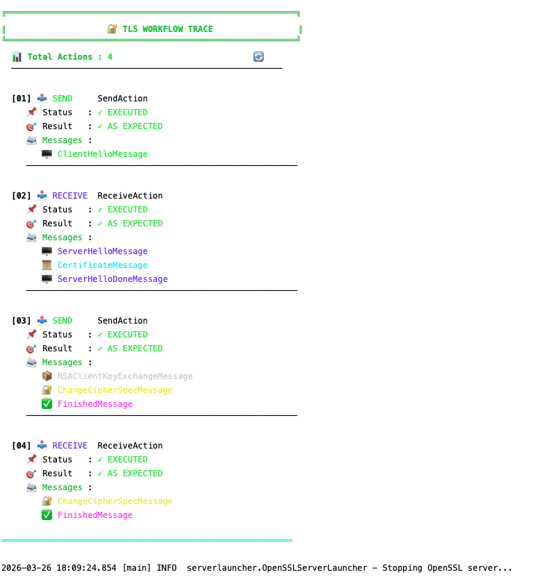

# TLS-Attacker Workflow Explorer

[](https://www.oracle.com/java/technologies/javase-downloads.html)
[](https://github.com/tls-attacker/TLS-Attacker)
[](LICENSE)

A Java project for exploring, testing, and understanding TLS exchanges using the TLS-Attacker framework.

## 📖 Table of Contents

- [Introduction](#introduction)
- [Architecture](#architecture)
- [Key Concepts](#key-concepts)


## Introduction

### What is this project?

This project is a practical exploration of the TLS-Attacker framework. It allows you to programmatically build, send, and analyze TLS exchanges in Java.

In other words: instead of using a browser or a classic TLS client, you code the messages you want to send to the server, in any order you want, and observe exactly what happens.

> 💡 **Simple Analogy**
>
> Imagine TLS is a secure handshake protocol between two people.
>
> This project gives you complete control over every step of that handshake:
> you decide what to say, when to say it, and you read exactly what the other person responds.


## Architecture

### Overview

The project is organized into 5 distinct packages, each with a clear and well-defined responsibility:

| Package | Main Class | Responsibility |
|---------|------------|----------------|
| `config` | `TlsClientConfig` | TLS settings: host, port, versions, cipher suites |
| `workflow` | `TlsWorkflowBuilder` | Construction of TLS message sequences |
| `executer` | `TlsWorkflowExecutor` | Workflow execution over the network |
| `handler` | `TlsMessageHandler` | Result analysis and inspection |
| `serverlauncher` | `OpenSSLServerLauncher` | Automatic startup of a test TLS server |

### Execution Flow


```markdown

1. **App.main()** → Entry point, registers BouncyCastle
   ↓
2. **OpenSSLServerLauncher** → Generates certificate and starts TLS server
   ↓
3. **TlsClientConfig** → Creates TLS configuration (host, port, ciphers)
   ↓
4. **TlsWorkflowBuilder** → Builds the sequence of messages to send
   ↓
5. **TlsWorkflowExecutor** → Executes the workflow on the real network
   ↓
6. **TlsMessageHandler** → Analyzes sent and received messages
   ↓
7. **OpenSSLServerLauncher** → Properly shuts down the server (finally block)
```


## Key Concepts

### WorkflowTrace

A `WorkflowTrace` is simply an ordered list of TLS actions. Each action can be:

| Action Type | Description |
|-------------|-------------|
| `SendAction` | Sends one or more TLS messages to the server |
| `ReceiveAction` | Waits for and reads specific messages from the server |
| `GenericReceiveAction` | Receives any message without filtering |


### BouncyCastle 

TLS-Attacker uses BouncyCastle as its cryptography provider. It's an open-source Java library that implements all necessary cryptographic algorithms (RSA, AES, SHA, ECDHE, etc.).

> ⚠️ **Important Note**
>
> BouncyCastle must be registered **MANUALLY** before any TLS-Attacker calls:
>
> ```java
> Security.insertProviderAt(new BouncyCastleProvider(), 1);
> ```
>
> Without this line, the program throws a `BouncyCastleNotLoadedException`.


## Result




# TLS 1.3 Handshake

## 📖 Sommaire

1. [Introduction](#introduction)
2. [Vue d'ensemble du handshake](#vue-densemble-du-handshake)
3. [Détail des messages](#détail-des-messages)
   - [ClientHello](#1-clienthello)
   - [ServerHello](#2-serverhello)
   - [EncryptedExtensions](#3-encryptedextensions)
   - [Certificate](#4-certificate)
   - [CertificateVerify](#5-certificateverify)
   - [Finished](#6-finished)
4. [Résumé séquentiel](#résumé-séquentiel)
5. [Différences avec TLS 1.2](#différences-avec-tls-12)
6. [Sécurité](#sécurité)
7. [Références](#références)
8. [Annexe : Exemple de handshake analysé](#annexe--exemple-de-handshake-analysé)


## Introduction

**TLS 1.3** (RFC 8446) est la version majeure la plus récente du protocole TLS. Elle simplifie le handshake, améliore la sécurité et réduit la latence par rapport à TLS 1.2.

Ce document décrit le **handshake complet** d'une connexion TLS 1.3, tel qu'observé dans une capture réseau réelle.


## Vue d'ensemble du handshake

```
Client                                    Serveur
  |                                          |
  |-------- ClientHello -------------------->|
  |                                          |
  |<------- ServerHello ---------------------|
  |<------- EncryptedExtensions -------------|
  |<------- Certificate ---------------------|
  |<------- CertificateVerify ---------------|
  |<------- Finished ------------------------|
  |                                          |
  |-------- Finished ----------------------->|
  |                                          |
  |<======= Données applicatives chiffrées ==>|
```

> ℹ️ En TLS 1.3, **le certificat du serveur peut être chiffré** (dans certaines configurations), contrairement à TLS 1.2.


## Détail des messages

### 1. ClientHello

Le client initie la connexion et annonce ses capacités.

```json
{
  "messageClass": "ClientHelloMessage",
  "timestamp": "2026-04-02T15:06:17.820045",
  "handshakeType": "ClientHello (1)",
  "handshakeLength": 278,
  "legacyVersion": "TLS12 (0x0303)",
  "clientRandom": "60B420BB3851D9D47ACB933DBE70399BF6C92DA33AF01D4FB770E98C0325F41D",
  "legacySessionIdLength": 0,
  "cipherSuiteLength": 10,
  "cipherSuites": [
    "TLS_AES_256_GCM_SHA384",
    "TLS_CHACHA20_POLY1305_SHA256",
    "TLS_AES_128_GCM_SHA256",
    "TLS_AES_128_CCM_8_SHA256",
    "TLS_AES_128_CCM_SHA256"
  ],
  "legacyCompressionMethodsLength": 1,
  "legacyCompressionMethods": "none (0x00)",
  "encryptedClientHello": false,
  "extensionsTotalLength": 227,
  "extensions": [
    {
      "extensionName": "ec_point_formats",
      "extensionLength": 2,
      "extensionContent": "0100"
    },
    {
      "extensionName": "elliptic_curves",
      "extensionLength": 80,
      "extensionContent": "004E000F0010001100120013001400150016001700180019000100020003000400050006000700080009000A000B000C000D000E001D001E0029001A001B001C001F0020002101000101010201030104"
    },
    {
      "extensionName": "signature_and_hash_algorithms",
      "extensionLength": 10,
      "extensionContent": "rsa_pss_rsae_sha256, rsa_pss_rsae_sha384, ecdsa_secp256r1_sha256, Inconnu (0x0807)"
    },
    {
      "extensionName": "supported_versions",
      "extensionLength": 3,
      "extensionContent": "TLS13 (0x0304)"
    },
    {
      "extensionName": "key_share",
      "extensionLength": 107,
      "extensionContent": "namedGroup\u003d0x0069, keyLength\u003d29, publicKey\u003d0020B1E8236B631E19D86B28A6FF4D5F4B39D41EDDF47AB7D3A9579506"
    },
    {
      "extensionName": "renegotiation_info",
      "extensionLength": 1,
      "extensionContent": "00"
    }
  ]
}
```

| Champ | Rôle |
|-------|------|
| `cipherSuites` | Liste des algorithmes chiffrés supportés |
| `key_share` | Clé publique éphémère (ECDHE) |
| `supported_versions` | Versions TLS supportées (dont 1.3) |
| `signature_algorithms` | Algorithmes de signature acceptés |

---

### 2. ServerHello

Le serveur choisit les paramètres de la connexion.

```json
{
  "messageClass": "ServerHelloMessage",
  "timestamp": "2026-04-02T15:06:17.857804",
  "handshakeType": "ServerHello (2)",
  "handshakeLength": 86,
  "selectedVersion": "TLS12 (0x0303)",
  "serverRandom": "50B621E0BE935407777A9A3A6FAAC4A1E5D566D34B16E8FF8C637F9BCF4ED8DF",
  "legacySessionIdLength": 0,
  "selectedCipherSuite": "TLS_AES_256_GCM_SHA384",
  "selectedCompressionMethod": "none (0x00)",
  "extensionsTotalLength": 46,
  "extensions": [
    {
      "extensionName": "supported_versions",
      "extensionLength": 2,
      "extensionContent": "TLS13 (0x0304)"
    },
    {
      "extensionName": "key_share",
      "extensionLength": 36,
      "extensionContent": "namedGroup\u003dx25519, keyLength\u003d32, publicKey\u003dE203A153750F0FE3B8EAD5C8545802AE480E94520547745BE8107E25077C3078"
    }
  ]
}
```

| Champ | Rôle |
|-------|------|
| `selectedCipherSuite` | Suite chiffrée choisie |
| `key_share` | Clé publique du serveur (ECDHE) |

> 🔐 Les deux parties peuvent maintenant dériver la **clé de session** (via ECDHE).

---

### 3. EncryptedExtensions

Extensions qui n'ont pas besoin de confidentialité (envoyées en clair).

```json
{
  "messageClass": "EncryptedExtensionsMessage",
  "timestamp": "2026-04-02T15:06:17.859634",
  "warning": "Type de message non géré explicitement"
}
```

| Extension | Rôle |
|-----------|------|
| `application_layer_protocol_negotiation` | ALPN (HTTP/2, HTTP/3, etc.) |
| `max_fragment_length` | Taille maximale des fragments |

> ⚠️ Ce message n'existe pas en TLS 1.2 (les extensions étaient dans le ServerHello).


### 4. Certificate

Le serveur envoie son certificat X.509 (et éventuellement la chaîne de certification).

```json
{
  "messageClass": "CertificateMessage",
  "timestamp": "2026-04-02T15:06:17.860721",
  "handshakeType": "Certificate (11)",
  "handshakeLength": 689,
  "certificatesListLength": 685,
  "certificatesListBytes": "0002A8308202A43082018C0209009084F127A7E7D331300D06092A864886F70D01010B050030143112301006035504030C096C6F63616C686F7374301E170D3236303332363135353635375A170D3237303332363135353635375A30143112301006035504030C096C6F63616C686F737430820122300D06092A864886F70D01010105000382010F003082010A0282010100ACBC80757E94D8449B3D9A87B0DD01CAB67A4A736112B5CCF431C6C80604600ED75EEA9149FC287089FE3DB1704D70AB02FFB6CA48FF3B9E505DBCDF3BD7386B42DF150932E01ADC37640413AED83642E5FE58499057799803E08E8BCFD96875A8E1DE4F4E102EB83CC19253EF7C75DDEFFF9B9C3F7035D9A4D7EDF80BC6C1D7CBBD682AD6A36EA0706439EAE92C28992226B5A4C2D9F3611A851ED6D5A709E04B25BC519F5E132A10C1BF6DC9109346CF70085B01F38183D96F2E8369F4FEF007E30BA9457A937F9A526FC7D9F9DF483638C9443449FAEA04B1442B04A1E23CAB86B821C295F1F10652EE17DC3E267508C9ED07BDC9AB0D27A4D94700EB587B0203010001300D06092A864886F70D01010B0500038201010012349202FC2813129DD187A675F1A96A302B509BDC69021C0AF2182C6CD406992196ECB342B6172D6B6246F7FBD69CBC52DBD269A42CF4A35A5DD503A287D1E2EF58BA954D10C6EE08CF24629DEB5A35959A9AF72589F92CC5528F76E88B0F34152ABA7E7103634C16696C2FBB04E56D90266BDA7D6E3910A77724A6D332C2AF5054DEABE2E908FDA2CD799612066D1E313997A9151B304CD55167AAE73FE41554406253AFC3CA28EBE278E3FFDC7BEA6EE4188F4D5E6C892F3A025D3E05011D9EE4CA01D7F4EC88F422031A79CCEDCC9B715D24570EE216BC75A2C1240BDAB96ABF5F10F2F1581D67CF3AA532D8E3B2A6EF58667FEEBF6595C0993EE8D48DA50000"
}
```

| Champ | Rôle |
|-------|------|
| `certificate` | Certificat du serveur (ou client si authentification mutuelle) |
| `certificate_list` | Chaîne de certificats (émetteurs intermédiaires) |

> 🔐 En TLS 1.3, ce message peut être **chiffré** (pas dans cet exemple car pas de session résumée).

---

### 5. CertificateVerify

Preuve que le serveur possède la clé privée correspondant au certificat.

```json
{
  "messageClass": "CertificateVerifyMessage",
  "timestamp": "2026-04-02T15:06:17.863643",
  "handshakeType": "CertificateVerify (15)",
  "handshakeLength": 260,
  "signatureHashAlgorithm": "rsa_pss_rsae_sha256",
  "signatureLength": 256,
  "signature": "96315E36BA4C164E19D53ECCDC3F967908E3BEA179E23B941DF56A40BF1F1CF1D8F453417397B094369D40D452571517568F3B97E4E8921DEAFF3CC42DE22525EE50FEEDE1E0BFC59338B5B21F034B0466971306A22D10FB1F08E58ACE8ED4AA72D9AAAF48836E18425701674A31CD6406BB275734B0848B68D20B9D7168C3FB3F1AB2FA9C7C37692C2D73C564A2046B714EBFA2979F8B43571C243510BD7FB5A077BFC781ACBC558E98C2275F2CCDC9000D0942BBA830CFBD884018999D0E47229FDB3024F08B23B09AA5CAC5A7520E1DBB05A19F350BFF3272FE5BC3162503EA1484C0E51EBF09F9B0A57B963FC35F345DCDB3C0A124554089325560504294"
}
```

| Champ | Rôle |
|-------|------|
| `signatureHashAlgorithm` | Algorithme utilisé (RSA-PSS, ECDSA, etc.) |
| `signature` | Signature du handshake jusqu'à ce point |

**Ce que signe le serveur :**
```
"TLS 1.3, server CertificateVerify" + 0x00 + hash(Handshake Context)
```

> C'est la **preuve d'authenticité** du serveur.

---

### 6. Finished

Message qui vérifie l'intégrité du handshake.

```json
{
  "messageClass": "FinishedMessage",
  "timestamp": "2026-04-02T15:06:17.866544",
  "handshakeType": "Finished (20)",
  "handshakeLength": 48,
  "verifyData": "99B78D9722F8DBEDB0EB0C48DEFCA15085FD618C958E38A00FD1C0B93075B39C61FC46C9030298E9336A4B32C717736B"
}
```

| Champ | Rôle |
|-------|------|
| `verifyData` | HMAC de tous les messages précédents (clé dérivée du handshake) |

> 🔐 C'est le premier message **chiffré** avec les clés de session (sauf si 0-RTT).


## Résumé séquentiel

| Étape | Message | Contenu clé | Chiffré ? |
|-------|---------|-------------|------------|
| 1 | ClientHello | Cipher suites, key_share (public), versions | ❌ |
| 2 | ServerHello | Choix cipher, key_share (public) | ❌ |
| 3 | EncryptedExtensions | ALPN, extensions serveur | ❌ |
| 4 | Certificate | Certificat X.509 | ⚠️ Optionnel |
| 5 | CertificateVerify | Signature du handshake | ❌ |
| 6 | Finished (serveur) | HMAC du handshake | ✅ |
| 7 | Finished (client) | HMAC du handshake | ✅ |
| 8 | Application Data | HTTP, etc. | ✅ |

---

## Différences avec TLS 1.2

| TLS 1.2 | TLS 1.3 |
|---------|---------|
| 2 round-trips (2-RTT) | 1 round-trip (1-RTT) |
| Handshake en clair | Handshake partiellement chiffré |
| Certificat toujours en clair | Certificat chiffrable |
| Algorithmes : RSA, ECDHE, etc. | Algorithmes : ECDHE uniquement (pas de RSA key exchange) |
| Messages : KeyExchange, ServerHelloDone | Messages : EncryptedExtensions, CertificateVerify |
| Renégociation possible | Pas de renégociation (nouvelle connexion) |

---

## Sécurité

### Points forts de TLS 1.3

| Protection | Mécanisme |
|------------|-----------|
| Confidentialité | Chiffrement des données applicatives + parties du handshake |
| Intégrité | MAC (HMAC) sur tous les messages |
| Authenticité | Certificats + signature du handshake |
| PFS (Perfect Forward Secrecy) | ECDHE obligatoire |
| Anti-rejeu | Nonce unique + timestamp |
| Protection contre les downgrade | Extensions `supported_versions` et `signature_algorithms` |

### Attaques résolues

| Attaque | Solution TLS 1.3 |
|---------|------------------|
| FREAK, Logjam | Suppression des export cipher suites |
| POODLE | Suppression de SSLv3, TLS 1.0, 1.1 |
| BEAST, CRIME | Suppression de CBC, compression TLS |
| RC4 | Suppression de RC4 |
| Downgrade | Vérification croisée des versions |

---

## Références

| Document | Description |
|----------|-------------|
| [RFC 8446](https://datatracker.ietf.org/doc/html/rfc8446) | The Transport Layer Security (TLS) Protocol Version 1.3 |
| [IANA TLS Parameters](https://www.iana.org/assignments/tls-parameters/tls-parameters.xhtml) | Liste complète des extensions, cipher suites, etc. |
| [TLS 1.3 Handshake (Cloudflare)](https://blog.cloudflare.com/tls-1-3-handshake/) | Explication visuelle |

---

## Annexe : Exemple de handshake analysé

Les messages analysés dans cette documentation proviennent d'une capture réelle :

| Message | Taille | Contenu notable |
|---------|--------|------------------|
| ClientHello | 278 octets | TLS 1.3, x25519, AES-256-GCM |
| EncryptedExtensions | (non décodé) | ALPN, extensions |
| Certificate | 689 octets | Certificat localhost (auto-signé) |
| CertificateVerify | 260 octets | Signature RSA-PSS-SHA256 |
| Finished | (à suivre) | Vérification HMAC |
